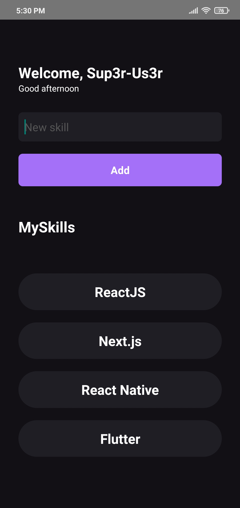

# Ignite Project
Simple app created with React Native, to add your skills, but with a focus on E2E testing using Detox.

# Screenshot
<p align="center">
  
</p>

## 🚀 Techs & Tools
→ [**React Native**](https://reactnative.dev)

→ [**TypeScript**](https://www.typescriptlang.org)

→ [**Detox**](https://github.com/wix/Detox)

## 📄 Detox E2E Test
Below is a faster documentation for setting up Detox on Android, as IOS is much simpler.

The content was removed from the [official documentation](https://github.com/wix/Detox), which is your main source of reference, due to future updates for example.

<details>
<summary>1. Detox CLI and Detox on project:</summary>

```bash
$ npm install -g detox-cli

$ npm install detox --save-dev
# or
$ yarn add detox -D
```

> obs: Jest is required

```bash
$ npm install jest --save-dev
# or
$ yarn add jest -D
```
</details>

<details>
<summary>2. In folder Android > build.gradle</summary>

```java
allprojects {
    repositories {
        ...
        maven {
            url "$rootDir/../node_modules/detox/Detox-android"
        }
    }
}
```
</details>

<details>
<summary>3. Android > App > build.gradle</summary>

```java
android {
    defaultConfig {
        ...
        // New dependencies to run tests
        testBuildType System.getProperty('testBuildType', 'debug')
        testInstrumentationRunner 'androidx.test.runner.AndroidJUnitRunner'
    }
}
```
</details>

<details>
<summary>4. Setup of test</summary>

Now, let's create a file called DetoxTest.java in the following path:

> android/app/src/androidTest/java/com/PACKAGE_NAME/DetoxTest.java

You will be able to get your package name, in the settings.gradle file located at:

> android > settings.gradle

In **rootProject.name** you get your package name

```java
package com.PACKAGENAME; // Change to PACKAGE NAME

import com.wix.detox.Detox;
import com.wix.detox.config.DetoxConfig;

import org.junit.Rule;
import org.junit.Test;
import org.junit.runner.RunWith;

import androidx.test.ext.junit.runners.AndroidJUnit4;
import androidx.test.filters.LargeTest;
import androidx.test.rule.ActivityTestRule;

@RunWith(AndroidJUnit4.class)
@LargeTest
public class DetoxTest {
    @Rule
    public ActivityTestRule<MainActivity> mActivityRule = new ActivityTestRule<>(MainActivity.class, false, false);

    @Test
    public void runDetoxTests() {
        DetoxConfig detoxConfig = new DetoxConfig();
        detoxConfig.idlePolicyConfig.masterTimeoutSec = 90;
        detoxConfig.idlePolicyConfig.idleResourceTimeoutSec = 60;
        detoxConfig.rnContextLoadTimeoutSec = (com.PACKAGENAME.BuildConfig.DEBUG ? 180 : 60); // Change to PACKAGE NAME

        Detox.runTests(mActivityRule, detoxConfig);
    }
}
```
</details>

<details>
<summary>5. Start Detox</summary>

```bash
$ yarn detox init -r jest
```
</details>

<details>
<summary>6. Update .detoxrc.json</summary>

```json
{
  "testRunner": "jest",
  "runnerConfig": "e2e/config.json",
  "configurations": {
    "android.emu.debug": {
      "type": "android.emulator",
      "binaryPath": "android/app/build/outputs/apk/debug/app-debug.apk",
      "build": "cd android && ./gradlew assembleDebug assembleAndroidTest -DtestBuildType=debug && cd ..",
      "device": {
        "avdName": "Pixel_3a_API_29"
      }
    }
  }
}
```

In **avdName** change to name of your Android emulator, if it contains white space replace to _

You get avdName run this command or using Android Studio:

```bash
$ emulator -list-avds
```
</details>

<details>
<summary>7. Generate build to test</summary>

```bash
# Android:
$ yarn detox build -c android.emu.debug

# IOS:
$ yarn detox build -c ios.sim.debug
```
</details>

<details>
<summary>8. Run test with Detox</summary>

```bash
# Android:
$ yarn detox test -c android.emu.debug

# IOS:
$ yarn detox test -c ios.sim.debug
```
</details>

## 💻 Run project
```bash
# Open terminal and clone this repository
$ git clone https://github.com/Sup3r-Us3r/ignite-project-my-skills-e2e-test.git

# Install dependencies
$ npm install
# or
$ yarn install

# Start the application
$ npx react-native start
$ npx react-native run-android # or run-ios
```
